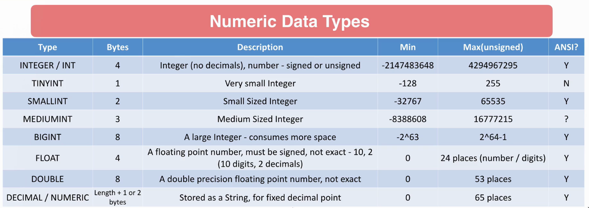
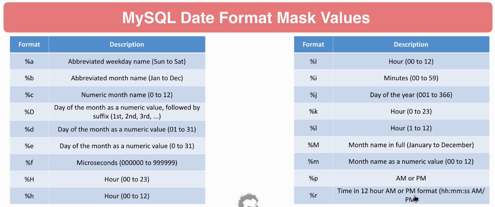
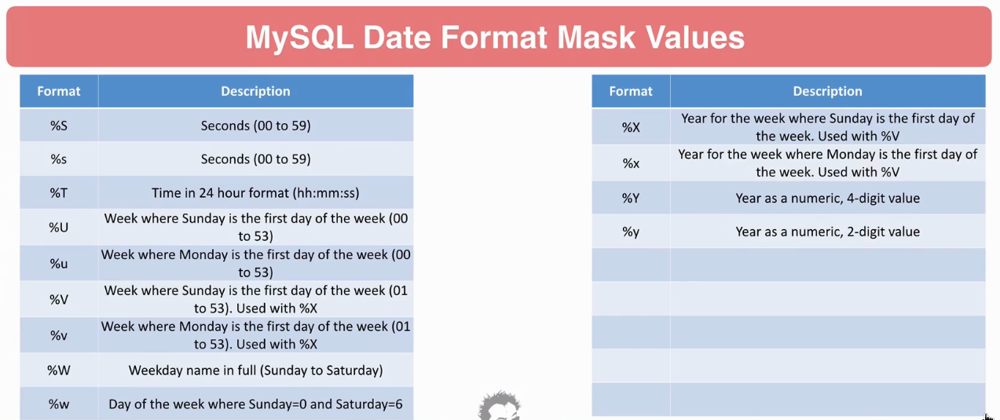

# SQL

## Setup

MySQL on Docker

`$ docker run --name mysql -e MYSQL_ROOT_PASSWORD=root -d mysql`
`$ docker exec -it mysql bash`
`# mysql --user=root -p`
`mysql> status`
`mysql> use mysql;`
`mysql> show tables;`
`mysql> describe user;`
`mysql> select host, user from user;`
`mysql> exit`
`# exit`

## Insert Update

**Create Insert**
```sql
CREATE TABLE customer (
	id INTEGER,
	first_name VARCHAR(100),
	last_name VARCHAR(100),
	address VARCHAR(100),
	city VARCHAR(2),
	zip_code VARCHAR(10)
);
```

**Insert table**
```sql
INSERT INTO customer VALUES (1234, 'Michael, 'Westom', '123 Brickel', 'Miami', 'FL', '33135');
```

## Select
```sql
select * from employee`
```

**Row count**
```sql
select count(*) from departments;`
```

**Aliases**
```sql
select first_name as 'First Name', last_name as 'Last Name' from employees;
```

**Concat**
```sql
select concat(first_name, ' ', last_name) as 'Name' from employees
```

**Arithmetic**
```sql
select salary * .01 as weekly from salaries
```

**Data types**



**Format dates**
```sql
DATE_FORMAT("2018-05-15", "%M %d %Y")
```



**Left right**
```sql
select left('asdf', 1); //a
select right('asdf', 1); //f
select first_name, last_name, concat(left(first_name, 1), left(last_name, 1)) from employees;
```
